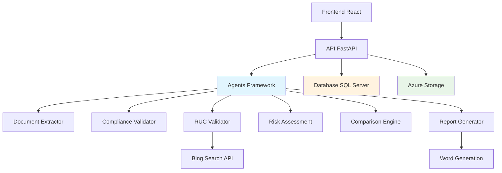

# TenderWise 🔍

**Intelligent Tender Document Analysis System**

Automatiza el análisis de documentos de licitación usando IA para reducir errores humanos, detectar riesgos legales/técnicos, acelerar revisiones y facilitar la comparación objetiva entre oferentes.

[](https://python.org)
[](https://fastapi.tiangolo.com)
[](https://azure.microsoft.com/en-us/products/ai-services)
[](LICENSE)

## 🎯 Características Principales

### 📄 **Análisis Automatizado de Documentos**
- **Extracción inteligente** de información estructurada de PDFs
- **Clasificación automática** por tipo de documento (pliegos, propuestas, contratos)
- **Validación de completitud** y coherencia de información

### ⚖️ **Validación de Cumplimiento LOSNCP**
- **Verificación automática** de límites legales (anticipos, garantías, multas)
- **Detección de incumplimientos** normativos
- **Alertas de riesgo** legal y regulatorio

### 🔗 **Verificación de Contratistas**
- **Validación de RUC** con algoritmo ecuatoriano oficial
- **Búsqueda web automatizada** de información empresarial
- **Evaluación de antecedentes** y capacidad financiera

### 📊 **Evaluación Integral de Riesgos**
- **Análisis multidimensional**: financiero, técnico, legal, operacional
- **Matriz de riesgos** con puntuación 1-5
- **Recomendaciones específicas** de mitigación

### 🏆 **Comparación de Propuestas**
- **Matriz comparativa** con criterios ponderados
- **Ranking automático** basado en puntuación objetiva
- **Recomendación de adjudicación** con justificación

### 📋 **Reportes Ejecutivos**
- **Generación automática** de reportes en Word
- **Dashboards interactivos** para visualización
- **Trazabilidad completa** del proceso de análisis

## 🏗️ Arquitectura del Sistema



### 🤖 **Agentes Especializados**

| Agente | Función | Capacidades |
|--------|---------|-------------|
| **Document Extractor** | Extracción de datos | OCR, NLP, estructuración JSON |
| **Compliance Validator** | Validación LOSNCP | Verificación legal, límites normativos |
| **RUC Validator** | Verificación contratista | Validación RUC, búsqueda web, scoring |
| **Risk Assessment** | Evaluación de riesgos | Análisis multidimensional, matriz 1-5 |
| **Comparison Engine** | Comparación propuestas | Scoring ponderado, ranking, recomendaciones |
| **Report Generator** | Generación reportes | Word, PDF, dashboards, visualizaciones |

## 🚀 Instalación y Configuración

### Prerrequisitos

- **Python 3.11+**
- **SQL Server** (Azure SQL Database recomendado)
- **Azure AI Project** con acceso a GPT-4
- **Azure Storage Account** (opcional)
- **Bing Search API** (opcional, para verificación de contratistas)

### 1. Clonar el Repositorio

```bash
git clone https://github.com/oh-qi-qi/azure-ai-agent-hackathon-2025.git
cd azure-ai-agent-hackathon-2025
```

### 2. Configurar Entorno Virtual

```bash
python -m venv venv
source venv/bin/activate  # En Windows: venv\Scripts\activate
pip install -r requirements.txt
```

### 3. Configurar Variables de Entorno

```bash
cp .env.example .env
# Editar .env con tus credenciales de Azure
```

**Variables críticas:**
```env
AZURE_AI_PROJECT_CONNECTION_STRING=your_connection_string
AZURE_OPENAI_ENDPOINT=https://your-openai.openai.azure.com/
AZURE_OPENAI_API_KEY=your_api_key
DATABASE_CONNECTION_STRING=your_sql_server_connection
```

### 4. Configurar Base de Datos

```bash
# Ejecutar el script SQL para crear las tablas
sqlcmd -S your_server -d TenderWiseDB -i sql/create_database.sql
```

### 5. Ejecutar la Aplicación

```bash
# Modo API (recomendado)
python main.py

# Modo CLI (para testing)
python main.py cli
```

La API estará disponible en: `http://localhost:8000`

Documentación interactiva: `http://localhost:8000/docs`

## 🐳 Despliegue con Docker

### Desarrollo

```bash
docker-compose -f docker-compose.yml -f docker-compose.dev.yml up
```

### Producción

```bash
docker-compose -f docker-compose.yml -f docker-compose.prod.yml up -d
```

## 📖 Uso del Sistema

### 1. **Análisis de Documento Individual**

```bash
curl -X POST "http://localhost:8000/api/documents/upload" \
     -H "Content-Type: multipart/form-data" \
     -F "file=@contrato_ejemplo.pdf"

curl -X POST "http://localhost:8000/api/analysis/tender" \
     -H "Content-Type: application/json" \
     -d '{"analysis_type": "comprehensive", "session_id": "your_session_id"}'
```

### 2. **Comparación de Múltiples Propuestas**

```bash
curl -X POST "http://localhost:8000/api/comparison/tender" \
     -H "Content-Type: application/json" \
     -d '{
       "proposal_ids": ["doc1", "doc2", "doc3"],
       "comparison_criteria": {
         "economic": 0.3,
         "technical": 0.4,
         "legal": 0.2,
         "risk": 0.1
       }
     }'
```

### 3. **Generación de Reportes**

```bash
curl -X POST "http://localhost:8000/api/reports/generate" \
     -H "Content-Type: application/json" \
     -d '{
       "session_id": "your_session_id",
       "conversation_id": "your_conversation_id",
       "report_type": "comprehensive"
     }'
```

## 📊 Ejemplos de Resultados

### Análisis de Cumplimiento LOSNCP

```json
{
  "compliance_status": "CONFORME",
  "validations": {
    "anticipo_maximo": {
      "requerido": "≤30%",
      "encontrado": "30%",
      "estado": "CONFORME"
    },
    "garantia_fiel_cumplimiento": {
      "requerido": "≥5%",
      "encontrado": "5%", 
      "estado": "CONFORME"
    }
  },
  "riesgo_general": "BAJO"
}
```

### Matriz de Comparación

| Propuesta | Económico | Técnico | Legal | Riesgo | **Total** | Ranking |
|-----------|-----------|---------|-------|--------|-----------|---------|
| EDIFIKA S.A. | 4.2 | 4.5 | 4.8 | 4.0 | **4.4** | 🥇 1° |
| CONSTRUCTORA XYZ | 4.8 | 3.8 | 4.2 | 3.5 | **4.1** | 🥈 2° |
| VIAL ECUATORIANA | 3.5 | 4.0 | 3.8 | 4.2 | **3.9** | 🥉 3° |

### Evaluación de Riesgos

```
🟢 RIESGO FINANCIERO: 2.1/5 (BAJO)
   - Monto: $20M (categoría alta pero manejable)
   - Anticipo: 30% (límite legal, requiere garantías)
   - Garantías: 16% total (cobertura excelente)

🟡 RIESGO TÉCNICO: 3.2/5 (MEDIO)
   - Complejidad: Alta (10 carriles, drenaje)
   - Plazo: 12 meses (ajustado pero factible)
   - Especificaciones: Completas

🟢 RIESGO LEGAL: 1.8/5 (BAJO)
   - Cumplimiento LOSNCP: 100%
   - Cláusulas: Completas y claras
   - Jurisdicción: Definida

⚠️ RECOMENDACIÓN: ADJUDICAR CON SUPERVISIÓN TÉCNICA INTENSIVA
```

## 🧪 Testing

```bash
# Ejecutar tests
pytest tests/ -v

# Con cobertura
pytest tests/ --cov=. --cov-report=html

# Tests específicos
pytest tests/test_compliance.py -v
```

## 🛠️ Desarrollo

### Estructura del Proyecto

```
tenderwise/
├── agents/              # Agentes especializados
│   ├── agent_definitions.py
│   ├── agent_manager.py
│   └── agent_strategies.py
├── api/                 # API FastAPI
│   └── main.py
├── config/              # Configuración
│   └── settings.py
├── managers/            # Lógica de negocio
│   ├── tender_analysis_manager.py
│   ├── document_manager.py
│   └── session_manager.py
├── plugins/             # Plugins especializados
│   ├── compliance_validation_plugin.py
│   ├── ruc_validation_plugin.py
│   ├── contract_risk_plugin.py
│   ├── comparison_plugin.py
│   └── report_file_plugin.py
├── utils/               # Utilidades
│   ├── document_utils.py
│   ├── file_utils.py
│   └── response_utils.py
├── sql/                 # Scripts de base de datos
│   └── create_database.sql
├── tests/               # Tests unitarios
├── uploads/             # Documentos subidos
├── reports/             # Reportes generados
└── main.py             # Punto de entrada
```

### Agregar Nuevas Funcionalidades

1. **Nuevo Agente**: Implementar en `agents/`
2. **Nuevo Plugin**: Implementar en `plugins/`
3. **Nueva API**: Agregar endpoint en `api/main.py`
4. **Nueva Validación**: Extender `compliance_validation_plugin.py`

## 🔒 Seguridad

- **Autenticación**: Azure AD (opcional)
- **Autorización**: RBAC por sesión
- **Encriptación**: HTTPS en producción
- **Validación**: Sanitización de inputs
- **Auditoría**: Log completo de acciones

## 📈 Monitoreo

- **Logs estructurados**: JSON con contexto completo
- **Métricas**: Tiempo de procesamiento, tasas de éxito
- **Alertas**: Errores críticos, timeouts
- **Dashboard**: Grafana con métricas clave

## 🤝 Contribuir

1. Fork el repositorio
2. Crear rama feature (`git checkout -b feature/nueva-funcionalidad`)
3. Commit cambios (`git commit -am 'Agregar nueva funcionalidad'`)
4. Push a la rama (`git push origin feature/nueva-funcionalidad`)
5. Crear Pull Request

## 📄 Licencia

Este proyecto está bajo la Licencia MIT. Ver [LICENSE](LICENSE) para más detalles.

## 🏆 Reconocimientos

- **Azure AI Hackathon 2025** - Proyecto desarrollado para el hackathon
- **Semantic Kernel** - Framework de agentes de Microsoft
- **FastAPI** - Framework web moderno y rápido
- **LOSNCP Ecuador** - Normativa de contratación pública

## 📞 Soporte

- **Documentación**: Ver `/docs` en la API
- **Issues**: [GitHub Issues](https://github.com/oh-qi-qi/azure-ai-agent-hackathon-2025/issues)
- **Email**: tenderwise@ejemplo.com

---

**TenderWise** - Transformando la contratación pública con Inteligencia Artificial 🚀